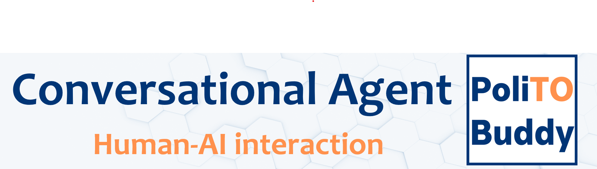
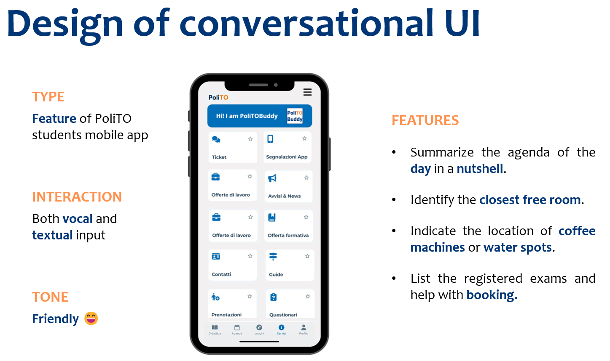

  

This project has been developed for the PhD course "Human AI interaction". The goal is to enhance the app of
Politecnico di Torino introducing a Conversational Agent following the [Microsoft Guidelines](https://www.microsoft.com/en-us/research/project/guidelines-for-human-ai-interaction/).

The code-base is taken from [dialogflow-weather](https://github.com/luigidr/dialogflow-weather). 
The code implements the Web Speech API (experimental) for speech-to-text and text-to-speech operations 
which has been tested in Chrome 57+, Firefox 70+, and Safari 10.1+. 
Please, notice that speech-to-text capability does not work in Safari and Firefox.
The Natural Language Processing is based on [Dialogflow ES](https://dialogflow.cloud.google.com/). 

  

# 👥 Contributors

- [Eleonora Poeta](https://www.linkedin.com/in/eleonora-poeta/)
- [Beatrice Alessandra Motetti](https://www.linkedin.com/in/beatrice-alessandra-motetti/)
- [Teresa Monti](https://www.linkedin.com/in/teresa-monti-aa6404217/)
- [Simone Papicchio](https://www.linkedin.com/in/simone-papicchio/)
